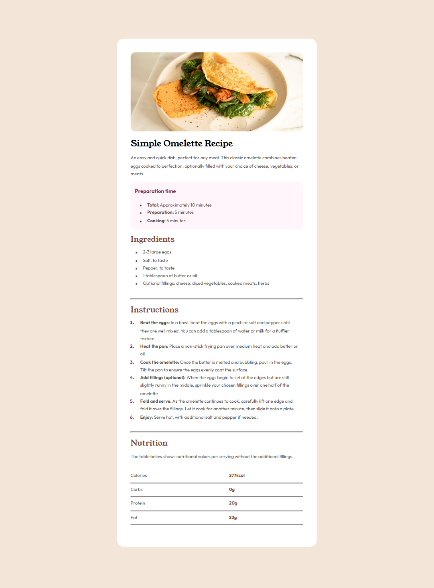

# Frontend Mentor - Recipe page solution


## Table of contents

- [Overview](#overview)
  - [The challenge](#the-challenge)
  - [Screenshot](#screenshot)
  - [Links](#links)
- [My process](#my-process)
  - [Built with](#built-with)
  - [What I learned](#what-i-learned)
  - [Continued development](#continued-development)
  - [Useful resources](#useful-resources)
- [Author](#author)
- [Acknowledgments](#acknowledgments)


## Overview
This is a solution to the [Recipe page challenge on Frontend Mentor](https://www.frontendmentor.io/challenges/recipe-page-KiTsR8QQKm). Frontend Mentor challenges help you improve your coding skills by building realistic projects. 

### Screenshot




### Links

- Solution URL: [Add solution URL here](https://your-solution-url.com)
- Live Site URL: [Add live site URL here](https://your-live-site-url.com)

## My process

### Built with

- Semantic HTML5 markup
- CSS custom properties
- CSS Grid


### What I learned

While this exercise flex my sore html and css muscles, I learnt new tricks too! Amazing tricks such as:


```css
ol li::marker{
        color: hsl(332, 51%, 32%);
        font-weight: 700;
}
```


### Continued development

I will do my best to improve my knowledge of html and css. 
- Using html tags
- Working with tables
- Linking fonts to css or html code

### Useful resources

- [W3 Schools](https://www.example.comhttps://www.w3schools.com/cssref/sel_marker.php) - This helped me break through almost every block I encountered. Their inbuilt code editor is a life saver.
- [Free Code Camp](https://www.example.comhttps://www.freecodecamp.org/) - This is an amazing resource I recommend for every beginner. 
- [Frontend Mentor](https://www.frontendmentor.io/profile/yourusername) - This provided me with practice exercises for frontend projects.

## Author

- Name - [Shalom Solomon]()
- Frontend Mentor - [@Shamara12](https://www.frontendmentor.io/profile/yourusername)

## Acknowledgments

All thanks to Agility Africa and our amazing tutor.

